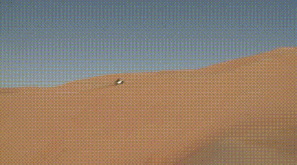
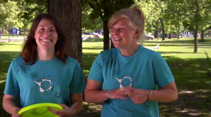

## **UMMAFormer**: A Universal Multimodal-adaptive Transformer Framework For Temporal Forgery Localization

<!-- 
 -->

This is the official repository of our Work submmited to ACM MM'23.
**Temporal Video Inpainting Localization(TVIL) dataset** and pytorch training/validation code for **UMMAFormer**.

    <h4 align="center">Overview of UMMAFormer</h4>

## Abstract

The emergence of  artificial intelligence-generated content~(AIGC) has raised concerns about the authenticity of multimedia content in various fields. Existing research has limitations and is not widely used in industrial settings, as it is only focused on binary classification tasks of complete videos. We propose a novel universal transformer framework for temporal forgery localization (TFL) called UMMAFormer, which predicts forgery segments with multimodal adaptation. We also propose a Temporal Feature Abnormal Attention (TFAA) module based on temporal feature reconstruction to enhance the detection of temporal differences. In addition, we introduce a parallel cross-attention feature pyramid network (PCA-FPN) to optimize the Feature Pyramid Network (FPN) for subtle feature enhancement. To address the lack of available datasets, we introduce a novel temporal video inpainting localization (TVIL) dataset that is specifically tailored for video inpainting scenes. Our experiments demonstrate that our proposed method achieves state-of-the-art performance on benchmark datasets, Lav-DF, TVIL, Psynd surpassing the previous best results significantly.

    <h4 align="center">Movitation of UMMAFormer</h4>

## TVIL dataset

### a. Data Download
If you need the TVIL dataset for academic purposes, please download the full data from [BaiduYun Disk](https://pan.baidu.com/s/1h3sHu56z3slJnPCH47QRsg?pwd=8tj1) (8tj1).

### b. Data Sources
The raw data is coming from [Youtube VOS 2018](https://codalab.lisn.upsaclay.fr/competitions/7685#participate-get_data).

<!-- 原图 -->

### c. Inpainting Methods
We use four different video inpainting methods to create new videos. They are [E2FGVI](https://github.com/MCG-NKU/E2FGVI), [FGT](https://github.com/hitachinsk/FGT), [FuseFormer](https://github.com/ruiliu-ai/fuseformer), and [STTN](https://github.com/researchmm/STTN), respectively. We used [XMEM](https://github.com/hkchengrex/XMem) to generate the inpainting mask.

### d. Feature Extract
We also provided [TSN features](https://pan.baidu.com/s/1h3sHu56z3slJnPCH47QRsg?pwd=8tj1) (code：8tj1) as used in the paper, specifically extracted by [mmaction2](https://github.com/open-mmlab/mmaction2).

## Code

The code will be released after paper accept.

## Results

## TODO List
- [ ] Release full code.
- [x] Release TVIL datasets and TSN features.
- [ ] Release TSN features and BYOL-A features for Lav-DF and Psynd 
- [ ] Release our pre-trained model

## Acknowledgement

Thanks for the work of [Actionformer](https://github.com/happyharrycn/actionformer_release). My code is based on the implementation of them.